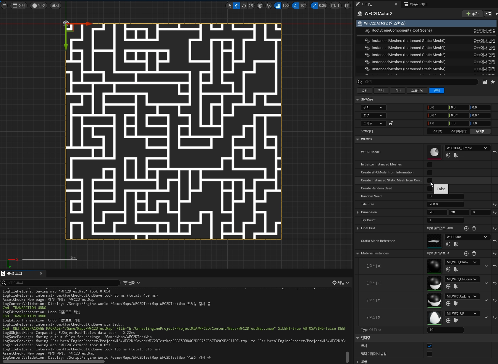
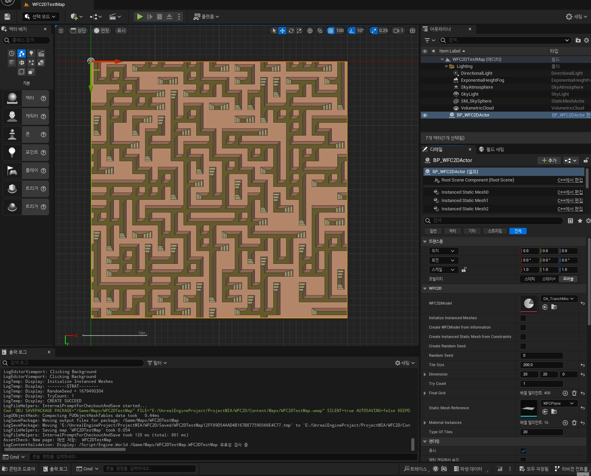
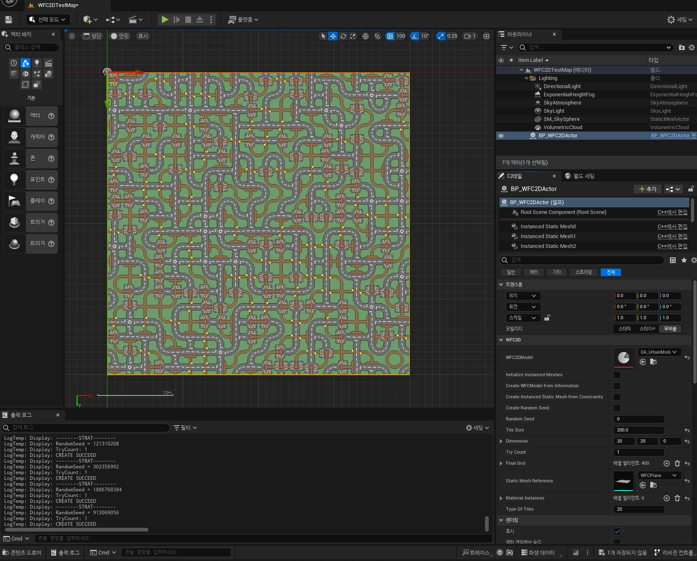
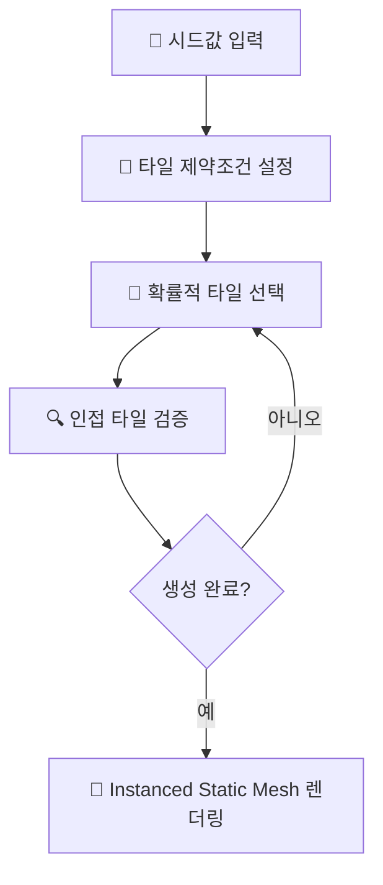

# 🎲 WFC2D - Wave Function Collapse 2D 지형 생성기

[](https://unrealengine.com/)
[](https://isocpp.org/)
[](LICENSE)
[](https://github.com/devouring123)

> **절차적 2D 지형 생성 시스템**  
> Wave Function Collapse 알고리즘으로 구현된 결정적 랜덤 지형 생성기

---

## 🎯 프로젝트 개요

**WFC2D**는 Unreal Engine 5에서 Wave Function Collapse 알고리즘을 활용하여 절차적으로 2D 랜덤 지형을 생성하는 고성능 시스템입니다. 시드 값에 따른 결정적 생성과 Instanced Static Mesh를 통한 최적화된 렌더링을 제공합니다.

### 🚀 핵심 성과
- **결정적 생성**: 동일한 시드값으로 일관된 지형 생성
- **최적화된 렌더링**: Instanced Static Mesh 활용으로 성능 극대화
- **직관적 인터페이스**: 디테일 패널의 버튼식 지형 생성
- **독립적 워크플로우**: 개발자-아티스트 분업 시스템
- **실시간 생성**: 에디터 내 즉시 반영

---

## 🎮 게임플레이 스크린샷

### Basic Tile 시스템

*기본 타일을 이용한 WFC 알고리즘 지형 생성 결과*

### Trench Tile 시스템  

*참호/도랑 타일을 활용한 복잡한 지형 구조*

### Urban Tile 시스템

*도시 환경 타일로 구성된 다양한 건물 배치*

---

## 🧮 Wave Function Collapse 알고리즘

### 핵심 개념
WFC 알고리즘은 제약 조건을 만족하면서 타일 기반으로 일관성 있는 패턴을 생성하는 절차적 생성 기법입니다.

### 구현 특징



1. **시드 기반 결정적 생성**: 동일한 시드값으로 재현 가능한 지형 생성
2. **타일 제약조건 시스템**: Edge 데이터 기반 연결 규칙 정의  
3. **실시간 생성**: 컨스트럭션 스크립트를 통한 에디터 내 즉시 반영
4. **최적화 렌더링**: Instanced Static Mesh로 메모리 및 성능 최적화

---

## 🏗️ 시스템 아키텍처

### 핵심 컴포넌트
```
WFC2D Actor 구조
├── WFC Algorithm Core (C++)
│   ├── Seed-based Random Generator
│   ├── Tile Constraint System  
│   └── Pattern Matching Logic
├── Data Asset Management
│   ├── Tile Information Storage
│   ├── Edge Constraint Data
│   └── Material Parameter Sets
└── Rendering System
    ├── Instanced Static Mesh Component
    ├── Construction Script Integration
    └── Real-time Preview System
```

### 기술 스택
- **엔진**: Unreal Engine 5
- **언어**: C++ (핵심 알고리즘), Blueprint (에디터 인터페이스)
- **최적화**: Instanced Static Mesh, Data Asset 시스템
- **워크플로우**: Construction Script, 디테일 패널 UI

---

## ⚡ 성능 및 최적화

### Instanced Static Mesh 활용
- **메모리 효율성**: 개별 액터 대신 인스턴스 사용으로 메모리 사용량 최소화
- **렌더링 최적화**: 단일 드로우 콜로 수백 개 타일 동시 렌더링
- **실시간 업데이트**: 컨스트럭션 스크립트를 통한 에디터 내 즉시 반영

### Data Asset 기반 관리
- **유연한 타일 설정**: 아티스트가 독립적으로 타일 속성 조정 가능
- **자동 제약조건 생성**: Edge 데이터 입력 후 자동 컨스트레인트 생성
- **확장 가능한 구조**: 새로운 타일 타입 추가 시 코드 수정 불필요

---

## 🎨 타일 시스템

### 지원 타일 유형
- **Basic Tiles**: 기본 지형 요소 (평지, 언덕, 물)
- **Trench Tiles**: 참호, 도랑, 함몰 지역
- **Urban Tiles**: 도시 환경, 건물, 도로망
- **커스텀 확장**: Data Asset을 통한 새로운 타일 추가 지원

### 타일 제약조건 시스템
```cpp
// 타일 Edge 데이터 예시
struct FTileEdgeData
{
    ETileEdgeType TopEdge;
    ETileEdgeType RightEdge; 
    ETileEdgeType BottomEdge;
    ETileEdgeType LeftEdge;
};

// 자동 제약조건 생성
bool CheckTileCompatibility(const FTileEdgeData& TileA, const FTileEdgeData& TileB)
{
    return TileA.RightEdge == TileB.LeftEdge; // 인접 타일 호환성 검사
}
```

---

## 🛠️ 개발 경험과 학습

### 핵심 기술 습득
- **Wave Function Collapse 알고리즘**: 제약 만족 문제 해결 및 절차적 생성
- **Unreal Engine 5 최적화**: Instanced Static Mesh, Construction Script 활용  
- **Data Asset 워크플로우**: 개발자-아티스트 협업 시스템 구축
- **절차적 생성**: 시드 기반 결정적 랜덤 생성 시스템

### 해결한 기술적 과제

#### 🎯 **결정적 생성 시스템**
- **문제**: 랜덤 생성의 재현성 보장
- **해결**: 시드 기반 의사난수 생성기로 일관된 결과 보장
- **결과**: 동일한 시드값으로 항상 같은 지형 생성

#### ⚡ **렌더링 최적화**  
- **문제**: 개별 액터 사용 시 성능 저하
- **해결**: Instanced Static Mesh로 전환하여 드로우 콜 최적화
- **결과**: 수백 개 타일도 부드러운 실시간 렌더링

#### 🔧 **워크플로우 효율화**
- **문제**: 타일 제약조건 수동 입력의 번거로움
- **해결**: Edge 데이터 기반 자동 컨스트레인트 생성 시스템
- **결과**: 아티스트의 독립적 작업과 개발 효율성 향상

---

## 📊 프로젝트 성과

### 기술적 성과
```
📁 프로젝트 규모:     중규모 언리얼 엔진 프로젝트
🧮 알고리즘 복잡도:   제약 만족 문제 (CSP) 해결
⚡ 성능 최적화:      Instanced Rendering 기반
🎨 타일 지원:       3가지 타일셋 (Basic, Trench, Urban)
🔄 실시간 생성:      에디터 내 즉시 미리보기
```

### 학습 성과
- **알고리즘 구현**: Wave Function Collapse의 실용적 적용
- **게임엔진 최적화**: 언리얼 엔진의 고급 렌더링 기법 활용
- **도구 개발**: 개발자-아티스트 워크플로우 최적화 도구 제작
- **절차적 생성**: 시드 기반 결정적 콘텐츠 생성 시스템

---

## 🚀 기술적 우수성

### 알고리즘 엔지니어링
✅ **복잡한 제약 조건 해결**: WFC 알고리즘의 효율적 구현  
✅ **결정적 생성 시스템**: 재현 가능한 절차적 콘텐츠 생성  
✅ **실시간 성능**: 에디터 내 즉시 반영 가능한 최적화  

### 게임 엔진 전문성
✅ **고급 렌더링 기법**: Instanced Static Mesh 활용 최적화  
✅ **에디터 확장**: Construction Script와 디테일 패널 통합  
✅ **데이터 드리븐 설계**: Data Asset을 통한 유연한 콘텐츠 관리  

### 소프트웨어 아키텍처
✅ **워크플로우 최적화**: 개발자-아티스트 독립 작업 환경 구축  
✅ **확장 가능한 설계**: 새로운 타일 타입 추가 용이성  
✅ **성능 중심 설계**: 메모리와 렌더링 효율성 고려  

---

## 🛠️ 시작하기

### 필수 요구사항
```bash
Unreal Engine 5.0 이상
Visual Studio 2019/2022 (C++ 개발 툴)
Windows 10/11 (64비트)
최소 8GB RAM (권장 16GB)
```

### 빠른 설정
```bash
# 1. 리포지토리 클론
git clone https://github.com/devouring123/WFC2D.git

# 2. 프로젝트 파일 생성  
WFC2D.uproject 우클릭 → Generate Visual Studio project files

# 3. 프로젝트 컴파일
Visual Studio에서 WFC2D.sln 열기 → 빌드

# 4. 에디터에서 실행
Unreal Editor로 WFC2D.uproject 열기 → 플레이
```

### 기본 사용법
```cpp
// 블루프린트에서 WFC2D 액터 설정:
- Grid Size: 원하는 지형 크기 (예: 20x20)
- Tile Data Asset: 사용할 타일셋 선택
- Random Seed: 지형 생성 시드값
- Generate 버튼 클릭으로 지형 생성
```

---

## 📚 기술 참고자료

### 알고리즘 학습
- **원본 WFC 연구**: [mxgmn/WaveFunctionCollapse](https://github.com/mxgmn/WaveFunctionCollapse)
- **제약 만족 문제**: CSP 이론과 백트래킹 알고리즘
- **절차적 생성**: Procedural Content Generation in Games

### Unreal Engine 기술
- **Instanced Static Mesh**: 렌더링 최적화 기법
- **Construction Script**: 에디터 내 실시간 업데이트 구현
- **Data Asset**: 게임 데이터 관리와 워크플로우 최적화

---

## 💡 개발 인사이트

### 🎯 **프로젝트를 통해 얻은 핵심 경험**

1. **알고리즘 실무 적용**: 이론적 WFC 알고리즘을 게임 개발에 실용적으로 적용
2. **성능 최적화 경험**: 렌더링 병목 해결과 메모리 효율성 개선  
3. **도구 개발 역량**: 개발자뿐만 아니라 아티스트도 사용할 수 있는 직관적 도구 제작
4. **워크플로우 설계**: 팀 협업을 고려한 독립적 작업 환경 구축

### 🔧 **아쉬웠던 점과 개선 방향**

1. **머티리얼 시스템의 제약**: Instanced Static Mesh의 개별 머티리얼 조정 한계
   - **개선 방안**: 머티리얼 파라미터 컬렉션 활용한 동적 머티리얼 시스템
   
2. **Edge 데이터 수동 입력**: 초기 타일 설정의 번거로움
   - **개선 완료**: 자동 컨스트레인트 생성 시스템으로 해결

---

## 🏆 포트폴리오 하이라이트

이 프로젝트는 다음을 입증합니다:
- **알고리즘 구현 능력**: 복잡한 제약 만족 문제의 효율적 해결
- **게임엔진 전문성**: 언리얼 엔진 5의 고급 기능 활용과 최적화
- **도구 개발 경험**: 개발 워크플로우 효율화를 위한 에디터 도구 제작  
- **성능 엔지니어링**: 실시간 렌더링과 메모리 최적화 고려
- **시스템 설계**: 확장 가능하고 유지보수가 용이한 아키텍처 구축

---

<div align="center">

**🌟 이 리포지토리가 도움이 되었다면 스타를 눌러주세요! 🌟**

[](https://github.com/devouring123/WFC2D/stargazers)
[](https://github.com/devouring123/WFC2D/network)

---

**🎮 Wave Function Collapse로 만든 절차적 지형 생성기**  
**💻와 ☕로 제작한 [devouring123](https://github.com/devouring123)**

</div>